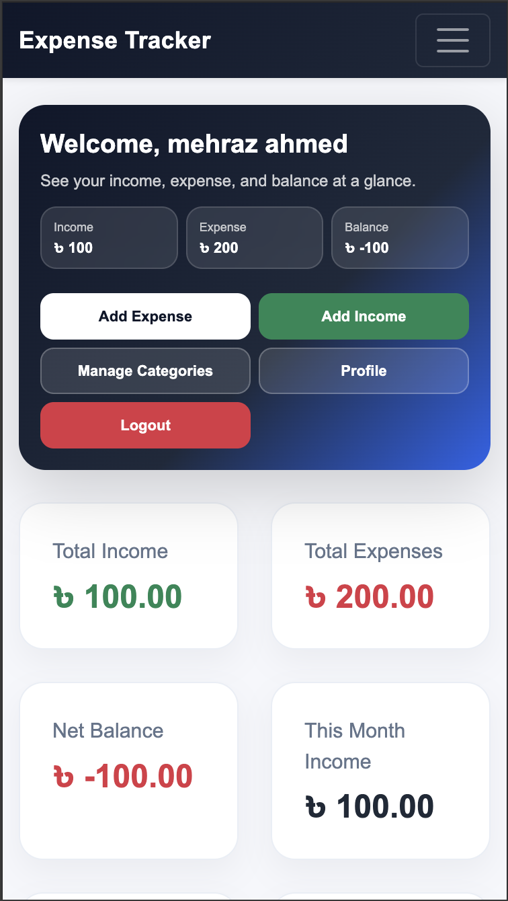

# Expense Tracker Pro

<p align="center">
  
</p>

<p align="center">
  <strong>A modern PHP + MySQL income and expense tracking system with Bangla/English support, dark mode, filters, profile management, category management, and analytics chart.</strong>
</p>

<p align="center">
  
  
  
  
  
</p>

---

## Overview

**Expense Tracker Pro** is a complete web-based personal finance management system built with **PHP, MySQL, Bootstrap, HTML, CSS, and JavaScript**.

It helps users track:

- Income
- Expenses
- Categories
- Payment methods
- Profile information
- Password updates
- Date-based analytics
- Mobile-friendly transaction management

The application supports both **Bangla** and **English**, includes **Light/Dark Mode**, and provides **interactive charts** for better financial insights.

---

## Features

### Authentication

- User registration
- User login
- Secure password hashing
- Logout support
- Session-based authentication

### Dashboard

- Clean overview section
- Total income
- Total expense
- Net balance
- This month income and expense
- Total categories
- Total entries

### Transactions

- Add income
- Add expense
- Edit transaction
- Delete transaction
- Mobile-friendly transaction cards
- Desktop transaction table

### Category Management

- Add category
- Edit category
- Delete category
- Category usage count
- Per-user category ownership

### Profile Management

- Update name
- Update email
- Update mobile number
- Change password

### Filters

- Keyword filter
- Category filter
- Transaction type filter
- Date presets:
  - Today
  - Yesterday
  - Last 7 Days
  - This Month
  - Last Month
  - Custom date range

### Analytics

- Doughnut chart
- Filtered chart section
- Chart expand / minimize
- Filter-ready analytics area

### UI / UX

- Bangla / English language switch
- Light / Dark mode
- Mobile optimized
- Modern premium dashboard layout
- Clean responsive cards and forms

---

## Technology Stack

| Layer    | Technology                           |
| -------- | ------------------------------------ |
| Frontend | HTML5, CSS3, Bootstrap 5, JavaScript |
| Backend  | PHP                                  |
| Database | MySQL                                |
| Chart    | Chart.js                             |
| Server   | XAMPP / InfinityFree / cPanel        |

---

## Project Structure

```text
expense-tracker/
│
├── assets/
│   └── style.css
│
├── config/
│   ├── app.php
│   └── db.php
│
├── includes/
│   ├── footer.php
│   ├── header.php
│   └── navbar.php
│
├── lang/
│   ├── bn.php
│   └── en.php
│
├── categories.php
├── dashboard.php
├── dashboard_filter.php
├── dashboard_chart_filter.php
├── delete_transaction.php
├── edit_transaction.php
├── index.php
├── login.php
├── logout.php
├── profile.php
├── signup.php
└── README.md
```
