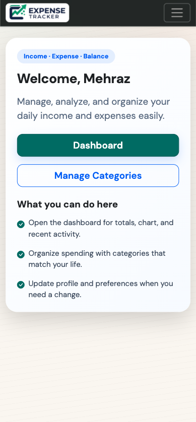
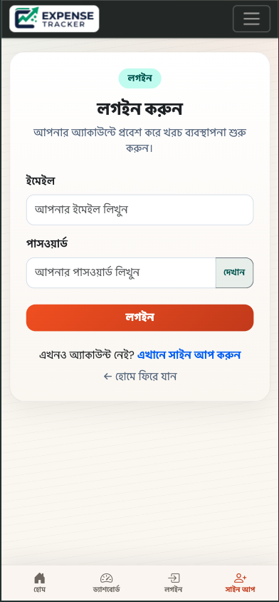
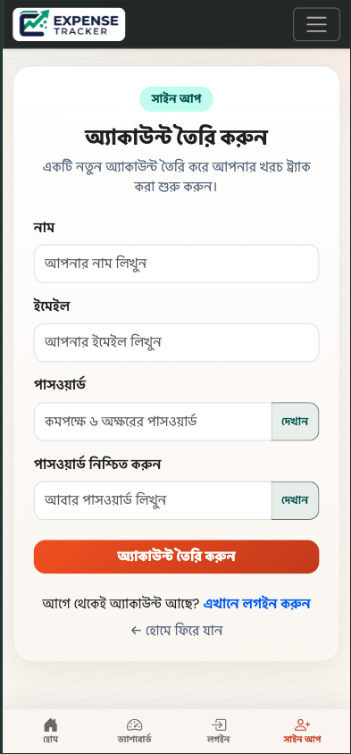
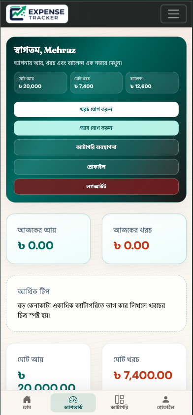
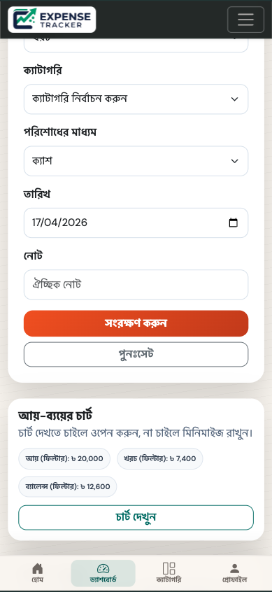
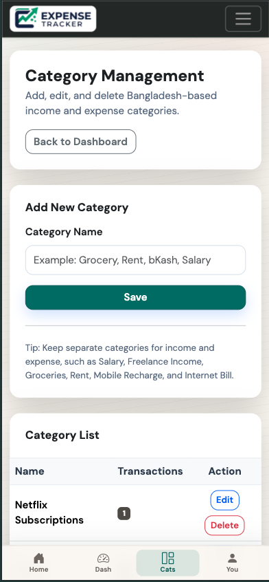
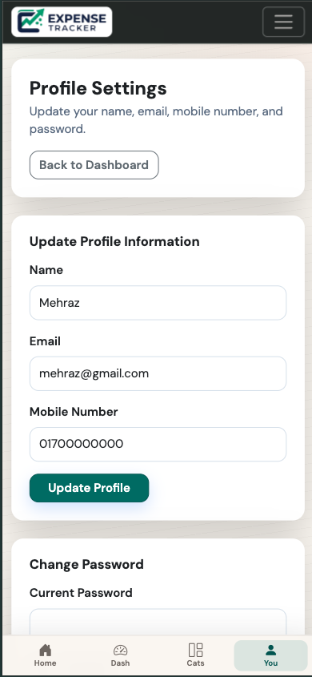
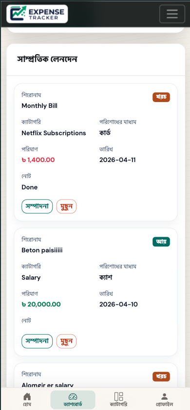
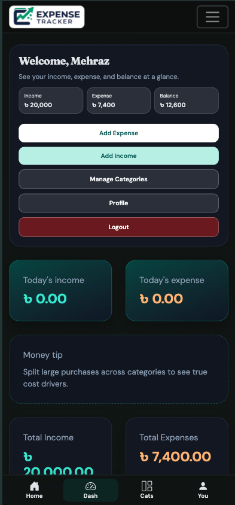

# Expense Tracker

A **session-based** PHP and MySQL web app for personal finance: record income and expenses in **Bangladeshi Taka (৳)**, manage categories, filter the dashboard, export **CSV**, and view **Chart.js** analytics. UI supports **বাংলা / English** and **light / dark** themes.

**Live demo:** [https://mehraz.infinityfree.me/expense-tracker/index.php](https://mehraz.infinityfree.me/expense-tracker/index.php)

<p align="center">
  <a href="https://mehraz.infinityfree.me/expense-tracker/index.php"></a>
  <a href="https://www.php.net/"></a>
  <a href="https://www.mysql.com/"></a>
  <a href="https://getbootstrap.com/"></a>
  <a href="https://www.chartjs.org/"></a>
</p>

---

## Contents

- [Live demo](#live-demo)
- [Features](#features)
- [Screenshots](#screenshots)
- [Requirements](#requirements)
- [Project structure](#project-structure)
- [Installation](#installation)
- [Database schema](#database-schema)
- [Configuration](#configuration)
- [i18n and themes](#i18n-and-themes)
- [Security](#security)
- [Deployment](#deployment)
- [Troubleshooting](#troubleshooting)
- [Roadmap](#roadmap)
- [Author](#author)

---

## Live demo

The app is deployed for preview at **[https://mehraz.infinityfree.me/expense-tracker/index.php](https://mehraz.infinityfree.me/expense-tracker/index.php)** (InfinityFree hosting). Use it to explore the UI; sign up or log in to try full features depending on how the host is configured.

---

## Features

| Area               | Description                                                                                                      |
| ------------------ | ---------------------------------------------------------------------------------------------------------------- |
| **Authentication** | Sign up, login, logout; passwords stored with `password_hash()`                                                  |
| **Dashboard**      | Totals, today’s summary, tips, add transaction, filters, doughnut chart; live refresh via `dashboard_filter.php` |
| **Guest preview**  | Dashboard readable without login; writes and CSV require an account                                              |
| **CSV export**     | `export_csv.php` — UTF-8 BOM, same filters as the dashboard, capped row count                                    |
| **Categories**     | Per-user CRUD                                                                                                    |
| **Profile**        | Name, email, mobile, password                                                                                    |
| **UI**             | Bootstrap 5, custom styling in `assets/css/style.css`, mobile-friendly shell                                     |

---

## Screenshots

Image paths are **relative to the repository root** (for example `screenshots/01-home.png`). GitHub renders them from the branch you are viewing. Ensure the `screenshots/` folder and all `.png` files are **committed and pushed**; filenames must match exactly.

|               Home               |               Login                |                Sign up                |
| :------------------------------: | :--------------------------------: | :-----------------------------------: |
|  |  |  |

|                 Dashboard                  |                    Chart & filters                     |                  Categories                  |
| :----------------------------------------: | :----------------------------------------------------: | :------------------------------------------: |
|  |  |  |

|                Profile                 |                             Mobile                             |                 Dark theme                 |
| :------------------------------------: | :------------------------------------------------------------: | :----------------------------------------: |
|  |  |  |

**Branding:** add `assets/images/logo.png` for the navbar and footer (optional but recommended).

---

## Requirements

- **PHP** 8.0+ (`mysqli`, sessions, JSON)
- **MySQL** 5.7+ or **MariaDB** (InnoDB, `utf8mb4`)
- A web server that runs PHP (e.g. Apache with XAMPP, or nginx + PHP-FPM)
- A modern browser (Chart.js on the dashboard)

---

## Project structure

```text
expense-tracker/
├── assets/
│   ├── css/style.css       # Theme + layout overrides (imports ../style.css)
│   ├── style.css           # Base components
│   ├── js/app.js           # Small UI helpers
│   └── images/logo.png     # Brand asset (optional)
├── config/
│   ├── app.php             # Timezone, i18n, theme, helpers, merged strings
│   └── db.php              # Database connection
├── includes/
│   ├── header.php
│   ├── navbar.php
│   └── footer.php
├── lang/
│   ├── bn.php
│   └── en.php
├── screenshots/            # README / docs imagery (commit for GitHub)
├── categories.php
├── dashboard.php
├── dashboard_filter.php    # AJAX: filtered chart + table HTML
├── delete_transaction.php
├── edit_transaction.php
├── export_csv.php
├── index.php
├── login.php
├── logout.php
├── profile.php
├── signup.php
└── README.md
```

---

## Installation

### 1. Place the project

Copy or clone the folder under your web root, for example:

`/Applications/XAMPP/xamppfiles/htdocs/expense-tracker`

### 2. Create the database

Create a database (e.g. `expense_tracker`) in phpMyAdmin or the MySQL client.

### 3. Import the schema

Run the SQL in [Database schema](#database-schema) in order: `users` → `categories` → `expenses`.

### 4. Configure the database

Edit `config/db.php` with host, user, password, database name, and port. XAMPP example:

```php
<?php
$host = '127.0.0.1';
$port = 3306;
$username = 'root';
$password = '';
$database = 'expense_tracker';

$conn = new mysqli($host, $username, $password, $database, $port);

if ($conn->connect_error) {
    die('Database connection failed.');
}

$conn->set_charset('utf8mb4');
```

### 5. Open the app

`http://localhost/expense-tracker/`

Register a user, create categories, then add transactions from the dashboard.

---

## Database schema

```sql
CREATE TABLE users (
    id INT NOT NULL AUTO_INCREMENT,
    name VARCHAR(100) NOT NULL,
    email VARCHAR(150) NOT NULL,
    mobile_number VARCHAR(20) DEFAULT NULL,
    password VARCHAR(255) NOT NULL,
    created_at TIMESTAMP NULL DEFAULT CURRENT_TIMESTAMP,
    PRIMARY KEY (id),
    UNIQUE KEY unique_email (email)
) ENGINE=InnoDB DEFAULT CHARSET=utf8mb4 COLLATE=utf8mb4_unicode_ci;

CREATE TABLE categories (
    id INT NOT NULL AUTO_INCREMENT,
    user_id INT NOT NULL,
    name VARCHAR(100) NOT NULL,
    created_at TIMESTAMP NULL DEFAULT CURRENT_TIMESTAMP,
    PRIMARY KEY (id),
    KEY idx_categories_user_id (user_id),
    CONSTRAINT fk_categories_user
        FOREIGN KEY (user_id) REFERENCES users(id)
        ON DELETE CASCADE
) ENGINE=InnoDB DEFAULT CHARSET=utf8mb4 COLLATE=utf8mb4_unicode_ci;

CREATE TABLE expenses (
    id INT NOT NULL AUTO_INCREMENT,
    user_id INT NOT NULL,
    category_id INT NOT NULL,
    transaction_type ENUM('expense','income') NOT NULL DEFAULT 'expense',
    payment_method ENUM('bkash','nagad','cash','bank','card','other') NOT NULL DEFAULT 'cash',
    title VARCHAR(150) NOT NULL,
    amount DECIMAL(10,2) NOT NULL,
    expense_date DATE NOT NULL,
    note TEXT DEFAULT NULL,
    created_at TIMESTAMP NULL DEFAULT CURRENT_TIMESTAMP,
    PRIMARY KEY (id),
    KEY idx_expenses_user_id (user_id),
    KEY idx_expenses_category_id (category_id),
    KEY idx_expenses_date (expense_date),
    CONSTRAINT fk_expenses_user
        FOREIGN KEY (user_id) REFERENCES users(id)
        ON DELETE CASCADE,
    CONSTRAINT fk_expenses_category
        FOREIGN KEY (category_id) REFERENCES categories(id)
        ON DELETE CASCADE
) ENGINE=InnoDB DEFAULT CHARSET=utf8mb4 COLLATE=utf8mb4_unicode_ci;
```

---

## Configuration

| File             | Purpose                                                                                                                                    |
| ---------------- | ------------------------------------------------------------------------------------------------------------------------------------------ |
| `config/db.php`  | Database credentials only                                                                                                                  |
| `config/app.php` | Timezone (`Asia/Dhaka`), language and theme session keys, merged UI strings, helpers (`e()`, `format_bdt()`, `safe_internal_path()`, etc.) |

**Production:** avoid exposing PHP errors to visitors. Remove or guard:

```php
error_reporting(E_ALL);
ini_set('display_errors', 1);
```

---

## i18n and themes

- Core copy: `lang/bn.php`, `lang/en.php`
- Extra strings are merged in `config/app.php`
- Switches: `?lang=bn` / `?lang=en` and `?theme=light` / `?theme=dark` (stored in session)

---

## Security

- Passwords: `password_hash()` / `password_verify()`
- SQL: prepared statements with bound parameters
- Data access scoped by `user_id` for categories and expenses
- Sensitive endpoints (e.g. CSV, filtered dashboard data for logged-in views) require an authenticated session where applicable
- `safe_internal_path()` limits `?next=` redirects to internal paths under `/expense-tracker/`

---

## Deployment

1. Upload files to the host document root or a subdirectory.
2. Create the MySQL database and import the schema.
3. Update `config/db.php` with production credentials.
4. Ensure PHP extensions `mysqli` and session support are enabled.
5. Prefer HTTPS; consider stricter session cookie flags in production.

---

## Troubleshooting

| Issue                         | What to check                                                   |
| ----------------------------- | --------------------------------------------------------------- |
| Database connection fails     | Host, port, user, password, database name, firewall             |
| Login always fails            | User exists; password column contains a bcrypt hash             |
| Chart is empty                | No rows for the selected filters; Chart.js loads without errors |
| 404 under `/expense-tracker/` | `DocumentRoot`, folder name, and hard-coded base paths in PHP   |

---

## Roadmap

- Pagination for long transaction lists
- Budgets or monthly targets
- PDF or Excel export
- Email password reset

---

## Author

**Khondokar Ahmed Mehraz** — [github.com/itz-mehraz](https://github.com/itz-mehraz)

Portfolio / educational project. Add a **license** (e.g. MIT) when you publish the repository publicly.

---

## Post-clone checklist

1. [ ] Create database and run schema SQL
2. [ ] Edit `config/db.php`
3. [ ] Add `assets/images/logo.png` (optional)
4. [ ] Commit `screenshots/*.png` if you want images on GitHub
5. [ ] Create user → categories → transactions
6. [ ] Disable `display_errors` for production
